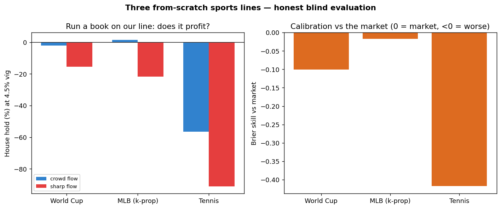

# Three from-scratch sports lines — can you beat the market, or be it?

> **TL;DR.** I built three models — **World Cup soccer, MLB, and tennis** — that set betting
> lines from team/player strength alone, **never seeing a sportsbook's odds** (verified by an
> adversarial leakage audit). Then I tested each one *blind*, settled on **real outcomes**,
> from both sides: as a **bettor** (can it beat the line?) and as a **book** (can it profitably
> *be* the line?). The honest answer: **no, on both counts** — but I can show exactly how close
> each gets and precisely how each fails. Everything here uses **only free, public data — zero
> paid APIs.**

This is a market-efficiency study, not a get-rich pitch. The rigor *is* the point.

---

## The headline result

Each model's probabilities were set pre-game with no access to any line; we then check
calibration against what actually happened and simulate running a book on the line, settling on
real results. (`casino_sim/data/THREE_MODEL_SUMMARY.md`, `figures/three_model_summary.png`.)

| Sport | N | Brier (model / market) | Skill vs market | Favorites pred→actual | Book @4.5% vig (crowd) | (sharp) |
|---|---|---|---|---|---|---|
| **MLB (k-prop)** | 1,364 | .160 / .158 | −0.02 | 77%→83% (under-conf.) | **+1.5%** | −22% |
| **World Cup** | 43 | .157 / .143 | −0.10 | 71%→67% | −2.0% | −15% |
| **Tennis** | 26 | .213 / .150 | −0.42 | 78%→60% (over-conf.) | −57% | −91% |



**What it says, honestly:**
- **None beats the market's calibration** (every skill ≤ 0). The closing line is efficient.
- **None is sharp enough to *be* the book** against informed money — every "sharp flow" column is
  deeply negative. Only MLB props even skim the *casual* crowd at vig (+1.5%).
- The earlier "+$2.15M, be the house" figure assumed *our model = truth* (circular). Settled
  against **reality**, the vig gets eaten by mispricing. Your line has to actually be right —
  and ours isn't sharp enough.
- Each model fails differently, and we diagnosed each: **World Cup** over-rates weak-confederation
  (AFC) teams; **tennis** is over-confident on favorites; **MLB** under-prices both tails.

## Did the models just learn the line? (independence)

No — and that's the foundation. An adversarial leakage audit (three reviewers, each told to
*assume* the line leaks and prove it) confirmed the deployed models use **only** team/player
strength, never the market price. The line is read solely *after* the prediction, to grade it.
Full report: [`casino_sim/LEAKAGE_AUDIT.md`](casino_sim/LEAKAGE_AUDIT.md). The fact that our line
sits a real ~11pp off the market (rather than hugging it) is behavioral proof of independence.

## Our line vs real sportsbooks, game by game

For the World Cup we put our line next to real de-vigged book odds (Sporttery + Kalshi), in both
**% chance** and **American odds** (`casino_sim/data/book_comparison.md` /
`book_comparison_american.md`):

| Match | Our line | Sporttery | Kalshi | Consensus | Avg deviance |
|---|---|---|---|---|---|
| Argentina v Algeria | 79/17/4 | 69/21/10 | 68/20/11 | 69/21/11 | 6.5pp |

Per-sport reliability ("contract resolution") plots: `figures/wc_reliability.png`,
`mlb_reliability.png`, `tennis_reliability.png`.

## Data provenance & constraints (read this)

**Every number in this repo was produced from free, publicly available data — zero paid APIs,
zero paid data feeds.** Inputs: public international results + ClubElo, Kalshi's public order
book, Sporttery's public odds, and The Odds API **free tier** (500 req/mo).

This is a genuine constraint on the results, stated plainly rather than hidden: the models run on
**coarse free inputs and small settled samples** — no paid player-tracking, injury, lineup, or
sharp-odds feeds; no large historical odds archive. A paid data stack (richer features, far more
history) is the clearest path to a sharper line, and a plausible reason a well-resourced book
outperforms this one. The question this project answers is *"how far can free data + sound method
get you?"* — and the honest answer is **close to the market on easy games, not sharp enough to
beat or be it.**

## How it's built

- **Models (line-free):** national-team Elo + squad-strength Poisson/Dixon–Coles (soccer);
  per-PA strikeout model (MLB); Elo/surface model (tennis).
- **Validation harness:** forward closing-line value with clustered-bootstrap significance,
  Brier skill vs market, expected calibration error, paper-trade ledgers.
- **Blind evaluation:** model probabilities fixed pre-game, settled on real outcomes; book
  simulation under crowd (∝ market) and sharp (adverse-selection) flow.

## Reproduce

```bash
python3 casino_sim/house_backtest.py            # World Cup calibration + blind book backtest
python3 casino_sim/house_backtest_mlb.py        # MLB
python3 casino_sim/house_backtest_tennis.py     # tennis
python3 casino_sim/three_model_summary.py       # consolidated table + summary figure
python3 casino_sim/book_compare.py              # our line vs real books, per game (% + American)
```

No paid services; runs offline on committed data (matplotlib for the figures).

## Honest limitations

- Settled samples are selection-biased (traded subsets) and small for WC/tennis — Ns stated
  everywhere; conclusions are directional.
- Realized full-slate WC outcomes aren't in free data, so the WC backtest uses the settled
  contracts we have.

---

*Companion repository — how this whole system was built and validated by an autonomous AI
engineering agent:* **[agentic-quant-operator »](https://github.com/jhunter11/agentic-quant-operator)**
